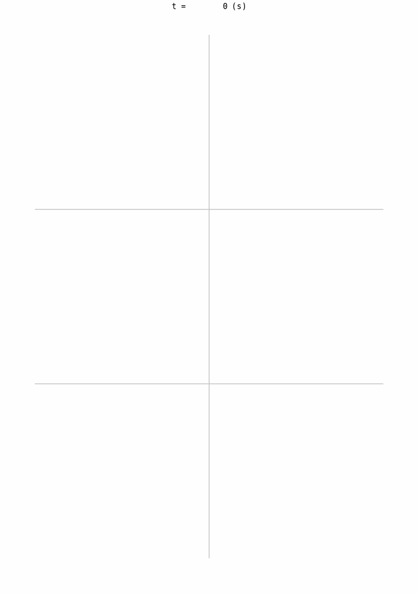

<br />
<br />

<p align="center">
    <picture>
        <source media="(prefers-color-scheme: dark)" srcset="./images/logo-dark.svg">
        <source media="(prefers-color-scheme: light)" srcset="./images/logo-light.svg">
        
    </picture>
</p>

<p align="center">
  Traffic lights optimization for city of <a href="https://www.trnava.sk/"><b>Trnava</b></a>
</p>

<br/>

---

>[!NOTE]
> ## Current State: PoC
> This project is currently a proof of concept made during the [Hacknime.to](https://www.hacknime.to/inovacie-pre-dynamicku-dopravu-trnavy-pomocou-ai/) competition that happend during 4.12 - 6.12.2024 and won the ***2. place***
>
> This project will likely stay in this form for the foreseeable future, as it was made for the competition only.


## Showcase

|    Before     |     After     |
| ------------- | ------------- |
|  |  |

We use [uxsim package](https://github.com/toruseo/UXsim) to simulate the traffic based upon data parsed from API response snapshot from [Invipo Cloud Solution](https://www.invipo.com/)


## Future Features
- [ ] 🚗 Waze Integration of incident avoidance
- [ ] 🚦 Real-Time model for adjusting the traffic light plans
- [ ] And more...

---

## Local Setup

> [!NOTE]
> This project uses [uv](https://docs.astral.sh/uv/) as the python venv and package manager

To **install** the virtual enviroment with all of the packages needed, run:
```
uv install
```

> [!IMPORTANT]
> We recommend to use [Visual Studio Code](https://code.visualstudio.com) with the [Jupyter Notebooks](https://marketplace.visualstudio.com/items?itemName=ms-toolsai.jupyter) extension

When using VSCode open the [simulation.ipynb]("./simulation.ipynb") file and press ***run all*** to get the results.

There is also an option to run the jupyter notebook in the browser with this command:
```
uv run --with jupyter jupyter lab
```